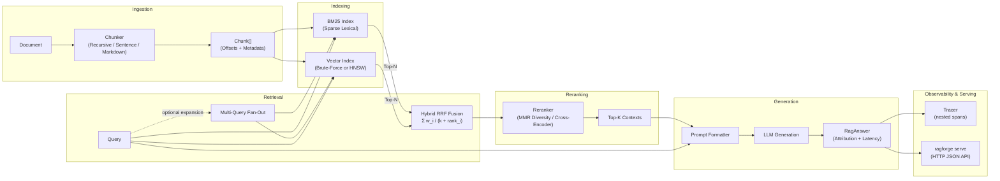

# ragforge

[](https://github.com/fragompul/ragforge/actions/workflows/ci.yml)
[](https://www.python.org/)
[](LICENSE)
[](https://github.com/astral-sh/ruff)
[](https://mypy-lang.org/)
[](https://github.com/fragompul/ragforge)
[](https://hypothesis.readthedocs.io/)

A production-hardened, zero-required-dependency RAG (Retrieval-Augmented Generation) engine designed with clean architecture, strict typing, and high reliability:
- **Multi-Strategy Chunking**: Hierarchical recursive, sentence-boundary, markdown header-aware, and sliding window chunkers with source character offsets.
- **Hybrid Retrieval**: Okapi BM25 sparse keyword search combined with dense vector cosine search via **Weighted Reciprocal Rank Fusion (RRF)**.
- **Approximate Nearest-Neighbor Search at Scale**: A from-scratch **HNSW** graph (`ragforge.ann`) as a pluggable, sub-linear alternative to brute-force cosine scan — see [`docs/benchmarks.md`](docs/benchmarks.md) for measured latency/recall numbers.
- **Multi-Query Expansion**: Fans a query out into rewritten variants (LLM-based or custom) and fuses results via RRF, recovering vocabulary-mismatch misses hybrid search alone can't catch.
- **Precision & Diversity Reranking**: Second-stage scoring with **Maximal Marginal Relevance (MMR)** (anti-redundancy), neural cross-encoder adapters, and heuristic token overlap.
- **Metadata Filtering**: First-class attribute filtering (`filter_fn`) for multi-tenant and category isolation.
- **Real Embedding Provider Adapters**: Lazy-import, zero-footprint bridges to OpenAI, Cohere, sentence-transformers, and Ollama — installing `ragforge` core never pulls in any of them.
- **RAGAS-Style Evaluation Engine**: Context Precision (Set & MAP@k), Context Recall, Context F1, Faithfulness (hallucination detection), Answer Relevancy, and Semantic Similarity.
- **Observability**: Dependency-free nested tracing (`ragforge.telemetry`) with console, in-memory, and OpenTelemetry-bridge exporters for per-stage latency breakdown.
- **Index Serialization & Persistence**: Clean JSON save/load routines for offline batch indexing and fast serving startup.
- **Production CLI & HTTP Serving**: Ingestion, querying, evaluation, benchmarking, and a dependency-free `ragforge serve` HTTP JSON API — all from one CLI.

---

## The Engineering Problem

Most RAG failures in production are not model failures—they are retrieval failures wearing an LLM's face:

1. **Diluted vs. Truncated Contexts**: Fixed-size chunking blindly splits sentences across boundaries or produces massive chunks that dilute keyword and vector matches.
2. **Dense-Only Blindspots**: Pure vector search consistently fails on exact identifiers (error codes, order IDs, product SKUs, proper nouns) that sparse keyword search nails instantly.
3. **Vocabulary Mismatch Survives Fusion**: Hybrid RRF fuses lexical and semantic signal for *one* phrasing of a query, but a paraphrase sharing no vocabulary with the target chunk ("cancel my plan" vs. "terminate subscription") can miss before fusion ever runs.
4. **Context Redundancy**: Top-k retrieval often returns 5 variations of the same paragraph, saturating the LLM context window without adding net new information.
5. **The Brute-Force Wall**: Linear cosine scan is exact but `O(n)` per query — fine at thousands of chunks, a real bottleneck at millions.
6. **Lack of Regression Testing & Observability**: Chunking tweaks, embedding model upgrades, or prompt changes ship without automated signals measuring whether retrieval precision or faithfulness regressed, or visibility into which pipeline stage is actually slow.

`ragforge` addresses all six challenges with modular components that can be inspected, tested, benchmarked, and customized.

---

## Architecture



See [`docs/architecture.md`](docs/architecture.md) for deep architectural diagrams and mathematical formulations.

---

## Installation

```bash
# Clone the repository
git clone https://github.com/fragompul/ragforge.git
cd ragforge

# Install in editable mode with development dependencies
pip install -e ".[dev]"
```

`ragforge` has **zero required third-party dependencies** for core operations, keeping installations instant and secure.

---

## Quickstart

### 1. Basic Ingestion, Hybrid Search & Answering

```python
from ragforge import RagPipeline
from ragforge.chunking import RecursiveCharacterChunker
from ragforge.reranking import HeuristicReranker

# Initialize pipeline with recursive chunker and heuristic reranker
pipeline = RagPipeline(
    chunker=RecursiveCharacterChunker(chunk_size=300, chunk_overlap=40),
    reranker=HeuristicReranker(),
)

# Ingest documents with metadata
pipeline.ingest(
    doc_id="eiffel_tower",
    text="The Eiffel Tower is in Paris, France. It was completed in 1889 and stands 330 meters tall.",
    metadata={"category": "monuments", "year": 1889},
)

# Retrieve contexts and generate an answer
response = pipeline.answer("How tall is the Eiffel Tower and when was it built?", k=2)

print(f"Answer: {response.answer}")
print(f"Retrieval Latency: {response.retrieval_latency_ms:.2f} ms")
for ctx in response.contexts:
    print(f"  [{ctx.doc_id}] (Score: {ctx.score:.3f}, Source: {ctx.provenance}) :: {ctx.text}")
```

---

### 2. Production Integration (OpenAI / Anthropic / Local Transformers)

Drop in external embedding and generation functions without changing the pipeline interface. The example below wires an `embed_fn`/`generate_fn` by hand to show the interface contract; for OpenAI, Cohere, sentence-transformers, or Ollama specifically, [`ragforge.embeddings_providers`](#7-real-embedding-provider-adapters) gives you a one-line factory instead.

```python
import openai
from ragforge import RagPipeline
from ragforge.chunking import SentenceChunker
from ragforge.reranking import CrossEncoderReranker

client = openai.OpenAI()

def openai_embed(text: str) -> list[float]:
    res = client.embeddings.create(input=[text], model="text-embedding-3-small")
    return res.data[0].embedding

def openai_generate(query: str, contexts: list[str]) -> str:
    context_block = "\n\n".join(contexts)
    res = client.chat.completions.create(
        model="gpt-4o-mini",
        messages=[
            {"role": "system", "content": "Answer the question strictly based on the provided context."},
            {"role": "user", "content": f"Context:\n{context_block}\n\nQuestion: {query}"},
        ],
        temperature=0.0,
    )
    return res.choices[0].message.content or ""

pipeline = RagPipeline(
    chunker=SentenceChunker(max_chars=500, overlap_sentences=1),
    embed_fn=openai_embed,
    generate_fn=openai_generate,
)
```

---

### 3. Metadata Filtering & MMR Diversity Reranking

```python
from ragforge import RagPipeline
from ragforge.chunking import RecursiveCharacterChunker
from ragforge.reranking import MaxMarginalRelevanceReranker

pipeline = RagPipeline(
    chunker=RecursiveCharacterChunker(chunk_size=300, chunk_overlap=30),
    reranker=MaxMarginalRelevanceReranker(lambda_mult=0.7),  # Balance relevance & novelty
)

pipeline.ingest_batch([
    {"id": "doc1", "text": "Enterprise SLA guarantees 99.99% uptime.", "metadata": {"tier": "enterprise"}},
    {"id": "doc2", "text": "Standard SLA guarantees 99.9% uptime.", "metadata": {"tier": "standard"}},
])

# Filter strictly for enterprise tier during retrieval
res = pipeline.answer(
    "What is the SLA uptime guarantee?",
    k=1,
    filter_fn=lambda chunk: chunk.metadata.get("tier") == "enterprise",
)
```

---

### 4. RAGAS-Style Automated Quality Evaluation

Run automated regressions to evaluate retrieval precision, context recall, faithfulness, and answer relevancy:

```python
from ragforge.evaluation import EvalCase, evaluate_pipeline

eval_cases = [
    EvalCase(
        query="How tall is the Eiffel Tower?",
        relevant_doc_ids=["eiffel_tower"],
        ground_truth_answer="The Eiffel Tower is 330 meters tall.",
    ),
]

summary = evaluate_pipeline(pipeline, eval_cases, k=2)

# Print formatted markdown table
print(summary.to_markdown_table())

# Save report for CI artifact tracking
summary.save("eval_report.json")
```

Output:
| Metric | Mean Score |
| :--- | :--- |
| **Overall Score** | `0.9850` |
| **Faithfulness** | `1.0000` |
| **Answer Relevancy** | `0.9520` |
| **Context Precision** | `1.0000` |
| **Ranked Precision (MAP@k)** | `1.0000` |
| **Context Recall** | `1.0000` |
| **Context F1** | `1.0000` |
| **Answer Similarity** | `0.9880` |
| **Mean Latency (ms)** | `1.42 ms` |

---

### 5. Index Persistence & Serving

```python
# Build and persist index in an offline batch job
pipeline.save("production_index.json")

# Load pre-built index in serving container in sub-milliseconds
serving_pipeline = RagPipeline.load("production_index.json")
answer = serving_pipeline.answer("What is our refund policy?", k=3)
```

---

### 6. Approximate Nearest-Neighbor Search at Scale (HNSW)

`VectorIndex` does an exact, brute-force cosine scan (`O(n)` per query). `ApproxVectorIndex` swaps in a from-scratch [HNSW graph](src/ragforge/ann.py) for expected `O(log n)` search, as a drop-in backend selectable from `RagPipeline` itself — no changes to retrieval, reranking, or evaluation code:

```python
pipeline = RagPipeline(
    chunker=RecursiveCharacterChunker(chunk_size=300, chunk_overlap=40),
    use_ann=True,
    ann_params={"m": 16, "ef_construction": 200, "ef_search": 50},
)
# Saving/loading preserves the chosen backend automatically.
pipeline.save("large_index.json")
reloaded = RagPipeline.load("large_index.json")
```

See [`docs/math.md`](docs/math.md#4-hnsw-approximate-nearest-neighbor-search-srcragforgeannpy) for the complexity argument and [`docs/benchmarks.md`](docs/benchmarks.md) for measured latency/recall numbers versus brute force.

---

### 7. Real Embedding Provider Adapters

Lazy-import adapters bridge `ragforge`'s zero-dependency core to real embedding models, each pulling in its client library only when called:

```python
from ragforge.embeddings_providers import cached_embed_fn, openai_embed_fn

# pip install ragforge[openai]
embed_fn = cached_embed_fn(openai_embed_fn(model="text-embedding-3-small"))
pipeline = RagPipeline(embed_fn=embed_fn)
```

`cohere_embed_fn`, `sentence_transformers_embed_fn` (`ragforge[local]`, fully offline), and `ollama_embed_fn` (no client library, plain HTTP to a local server) follow the same pattern. `cached_embed_fn` wraps any of them with an LRU cache to avoid re-embedding repeated text.

---

### 8. Multi-Query Expansion

Fan a query out into rewritten variants and fuse the results via the same Reciprocal Rank Fusion used to combine BM25 and vector search — recovering misses caused by vocabulary mismatch rather than retrieval failure:

```python
from ragforge.query_expansion import llm_query_expansion_fn

pipeline = RagPipeline(
    generate_fn=my_llm_generate_fn,
    query_expansion_fn=llm_query_expansion_fn(my_llm_generate_fn, num_variants=3),
)
# "cancel my plan" now also retrieves against LLM-generated variants like
# "terminate my subscription", fused with the original query via RRF.
answer = pipeline.answer("cancel my plan", k=3)
```

---

### 9. Observability: Per-Stage Tracing

Nested spans around retrieval, fusion, reranking, and generation — with zero required tracing dependency:

```python
from ragforge.telemetry import InMemoryExporter, Tracer

exporter = InMemoryExporter()
pipeline = RagPipeline(tracer=Tracer(exporters=[exporter]))
pipeline.answer("How does hybrid search work?", k=3)

for span in exporter.spans:
    print(f"{span.name}: {span.duration_ms:.2f}ms")
# retrieve -> fusion_search, rerank; generate -- nested under "answer"
```

Bridge into a real observability backend with `ragforge.telemetry.otel_exporter(tracer)` (requires `opentelemetry-api`), or print live traces from the CLI with `ragforge query "..." --trace`.

---

### 10. Serving Over HTTP

A minimal, dependency-free JSON API built on `http.server` — no web framework required:

```python
from ragforge.server import serve_forever_blocking

pipeline = RagPipeline.load("production_index.json")
serve_forever_blocking(pipeline, host="0.0.0.0", port=8000)
# GET  /health -> {"status": "ok", "document_count": N, "chunk_count": M}
# POST /query  -> {"query": "...", "k": 3} -> RagAnswer.to_dict()
```

Or from the CLI: `ragforge serve --index production_index.json --port 8000`.

---

## Command Line Interface (CLI)

`ragforge` provides a built-in CLI for indexing, querying, evaluating, and benchmarking:

```bash
# Ingest markdown and text documentation into a persistent index (add --ann for HNSW)
ragforge ingest ./docs --index rag_index.json --chunk-size 400 --ann

# Query the index with MMR reranking and a per-stage latency trace
ragforge query "How does hybrid search work?" --index rag_index.json --reranker mmr -k 3 --trace

# Run automated evaluation test suite
ragforge evaluate eval_cases.json --index rag_index.json -o report.json

# Run synthetic throughput and latency benchmark
ragforge benchmark

# Serve the index over a minimal dependency-free HTTP JSON API
ragforge serve --index rag_index.json --port 8000
```

---

## Runnable Examples

Complete, self-contained examples are available in the [`examples/`](examples/) directory:

```bash
python examples/basic_pipeline.py                  # End-to-end ingestion, retrieval & answers
python examples/hybrid_vs_single.py                # Demonstrates hybrid RRF beating BM25/Vector alone
python examples/evaluate_suite.py                  # Automated RAGAS-style evaluation and reporting
python examples/metadata_filtering_and_mmr.py      # Metadata filtering and MMR context diversity
python examples/persistence_and_serialization.py   # Index serialization and zero-recomputation loading
```

---

## Benchmarks

Real, reproducible measurements (not vibes) comparing brute-force vs. HNSW search and reporting ingestion throughput — generated by [`scripts/generate_benchmarks.py`](scripts/generate_benchmarks.py) using only `ragforge`'s own code:


Full numbers, the recall-vs-`ef_search` deep dive, and ingestion throughput are in [`docs/benchmarks.md`](docs/benchmarks.md).

---

## Key Design Decisions & Rationale

Full derivations for every item below live in [`docs/math.md`](docs/math.md).

- **Rank-Based Fusion (RRF) vs Score Blending**: BM25 scores are unbounded ($0 \to \infty$) whereas cosine similarities range in $[-1.0, 1.0]$. RRF fuses rank positions rather than raw magnitudes, preventing scale distortion.
- **MMR for Diversity**: Mitigates "context redundancy," selecting diverse chunks across relevant sources so LLMs receive rich, non-repetitive contexts. The greedy selection loop is a submodular-maximization approximation with a provable $(1 - 1/e)$ optimality guarantee, not just a heuristic.
- **HNSW for Sub-Linear Search**: A multi-layer navigable graph gives expected $O(\log n)$ query time against brute force's $O(n)$, at the cost of exactness — deletions are lazy tombstones, a structural property of graph-based ANN shared by production systems like hnswlib, not an implementation gap.
- **Rank-Aware Context Precision (MAP@k)**: Measures whether relevant documents were placed at top ranks, catching ordering regressions that set-based precision misses.
- **Multi-Query RRF over Single-Query Retrieval**: Query rewriting fan-out is fused with the *same* RRF algorithm used for BM25/vector fusion, rather than a separate merging strategy — one mental model for combining any number of ranked lists.
- **Lazy-Import Adapters over Optional Dependencies**: Real embedding providers and OpenTelemetry are wired via factory functions that import their client library only when called, so `pip install ragforge` never pulls in packages a given deployment doesn't use.
- **Deterministic Embeddings for CI**: Built-in `hashing_embed` uses deterministic CRC32 hashing to enable zero-network unit tests and reproducible benchmarks in CI environments.

---

## Development & Verification

```bash
# Install development dependencies (pytest, ruff, mypy, hypothesis)
pip install -e ".[dev]"

# Format code
ruff format src tests examples scripts

# Lint code
ruff check src tests examples scripts

# Strict static type checking
mypy src

# Run test suite (incl. Hypothesis property-based tests) with branch coverage validation
pytest --cov=ragforge --cov-report=term-missing --cov-fail-under=90
```

---

## License

This project is licensed under the [MIT License](LICENSE).

---

## Author

**Francisco Javier Gómez Pulido**

*AI Lead @ AAPEX | Double Degree in Mathematics & Computer Science | Master's in Artificial Intelligence*

📫 **Let's connect:**
- **LinkedIn:** [linkedin.com/in/frangomezpulido](https://www.linkedin.com/in/frangomezpulido)
- **GitHub:** [github.com/fragompul](https://github.com/fragompul)
- **Email:** [frangomezpulido2002@gmail.com](mailto:frangomezpulido2002@gmail.com)
