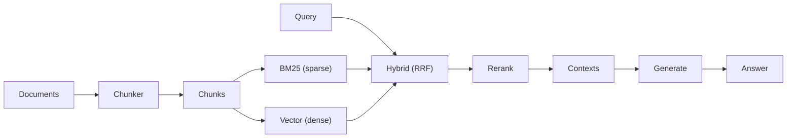

# ragforge

[](https://github.com/fragompul/ragforge/actions/workflows/ci.yml)
[](https://www.python.org/)
[](LICENSE)
[](https://github.com/astral-sh/ruff)

A production-hardened RAG (Retrieval-Augmented Generation) pipeline:
multi-strategy **chunking**, **hybrid search** (BM25 + vector, fused with
Reciprocal Rank Fusion), a pluggable **reranking** stage, and automatic
**RAGAS-style evaluation** (context precision/recall, faithfulness,
answer relevancy) — all with zero required third-party dependencies.

## The problem

The gap between a RAG demo and a production RAG system is almost never
the LLM call — it's everything around it:

- **Chunking is an afterthought** until retrieval quality tanks because
  chunks are too large (diluted matches) or too small (missing context).
- **Vector-only retrieval misses exact matches** — error codes, product
  SKUs, proper nouns — that a simple keyword search would nail instantly.
- **There's no regression signal.** A change to the chunking strategy,
  the embedding model, or the prompt ships with no automated way to know
  if retrieval quality or answer faithfulness got worse.

`ragforge` packages the patterns that address all three — configurable
chunking, hybrid retrieval, reranking, and automatic evaluation — as a
small, readable library rather than a black-box framework.

## Architecture



See [`docs/architecture.md`](docs/architecture.md) for the full pipeline
and evaluation diagrams and the design rationale.

## Installation

```bash
pip install -e ".[dev]"
```

## Quickstart

```python
from ragforge import RagPipeline
from ragforge.chunking import SentenceChunker
from ragforge.reranking import HeuristicReranker

pipeline = RagPipeline(
    chunker=SentenceChunker(max_chars=200, overlap_sentences=1),
    reranker=HeuristicReranker(),
)
pipeline.ingest("eiffel_tower", "The Eiffel Tower is in Paris. It stands 330 meters tall.")

answer = pipeline.answer("How tall is the Eiffel Tower?", k=2)
print(answer.answer)
for context in answer.contexts:
    print(f"  [{context.doc_id}] {context.score:.3f} :: {context.text}")
```

Swap in a real embedding model and LLM call for production:

```python
pipeline = RagPipeline(
    chunker=SentenceChunker(),
    embed_fn=my_embedding_api_call,          # str -> list[float]
    generate_fn=lambda q, ctx: my_llm_call(q, ctx),  # (str, list[str]) -> str
)
```

### Evaluate retrieval + generation quality (RAGAS-style)

```python
from ragforge.evaluation import EvalCase, evaluate_pipeline

cases = [EvalCase(query="How tall is the Eiffel Tower?", relevant_doc_ids=["eiffel_tower"])]
results = evaluate_pipeline(pipeline, cases, k=1)

for r in results:
    print(r.faithfulness, r.answer_relevancy, r.context_precision, r.context_recall, r.overall)
```

Full runnable examples in [`examples/`](examples/):

```bash
python examples/basic_pipeline.py      # ingest -> retrieve -> rerank -> answer
python examples/hybrid_vs_single.py    # why hybrid beats BM25 alone on paraphrases
python examples/evaluate_suite.py      # RAGAS-style scoring over a QA suite
```

## Key design decisions

- **Reciprocal Rank Fusion, not a weighted score blend.** BM25 scores and
  cosine similarities aren't on comparable scales; RRF fuses on rank
  position, so there's no blend ratio to tune.
- **Reranking is a separate, pluggable stage** — the standard two-stage
  retrieve-then-rerank pattern. `HeuristicReranker` is a dependency-free
  stand-in for a real cross-encoder.
- **Two chunking strategies, not one default** — `FixedSizeChunker` for
  homogeneous text, `SentenceChunker` for prose — because that tradeoff
  is real and worth making explicit.
- **Context precision/recall report `None` without ground truth**, rather
  than a misleading `0.0` that could hide a real regression.

## Why this matters

Most RAG failures in production aren't LLM failures — they're retrieval
failures wearing an LLM's face. A model that hallucinates because it was
given the wrong context looks identical, from the outside, to a model
that hallucinates because it's a bad model. Treating chunking, hybrid
retrieval, and reranking as first-class, testable components — with
automatic evaluation catching regressions the same way a unit test suite
catches a broken function — is what turns "it worked in the demo" into
something that survives contact with real documents and real queries.

## Development

```bash
pip install -e ".[dev]"
ruff check src tests examples
mypy src
pytest --cov=ragforge --cov-report=term-missing
```

## License

[MIT](LICENSE)

## Author

**Francisco Javier Gómez Pulido**

*AI Lead @ AAPEX | Double Degree in Mathematics & Computer Science | Master's in Artificial Intelligence*

📫 **Let's connect:**
* **LinkedIn:** [linkedin.com/in/frangomezpulido](https://www.linkedin.com/in/frangomezpulido)
* **GitHub:** [github.com/fragompul](https://github.com/fragompul)
* **Email:** [frangomezpulido2002@gmail.com](mailto:frangomezpulido2002@gmail.com)

---
*If you find this repository interesting or useful, feel free to ⭐ star it!*
