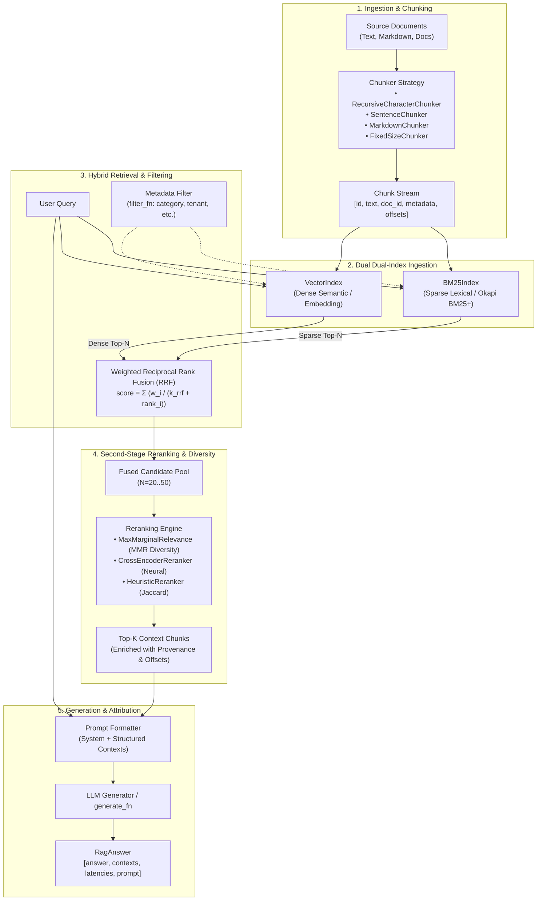
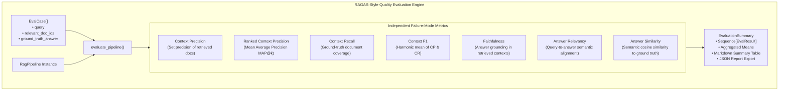

# Architecture & System Design

`ragforge` is designed around a modular, two-stage retrieve-and-rerank architecture with end-to-end evaluation and offline indexing capabilities.

---

## 1. End-to-End Pipeline Overview

---

## 2. Evaluation Flow (RAGAS-Style)

---

## 3. Key Architectural Decisions & Tradeoffs

### A. Reciprocal Rank Fusion (RRF) over Weighted Score Blending
- **The Problem:** BM25 produces unbounded positive scores ($0.0 \to \infty$) while cosine similarity bounded in $[-1.0, 1.0]$. Normalizing disparate score distributions via min-max scaling is brittle and sensitive to outlier chunks.
- **The Solution:** RRF operates purely on ordinal ranks:
  $$\text{RRF}(d) = \sum_{m \in \{\text{bm25}, \text{vector}\}} \frac{w_m}{k_{\text{rrf}} + \text{rank}_m(d)}$$
  This eliminates calibration drift and ensures neither signal dominates due to score magnitude.

### B. Maximal Marginal Relevance (MMR) for Context Window Optimization
- **The Problem:** Dense vector retrieval often returns top-5 chunks that are syntactic variations of the same paragraph, wasting precious LLM context tokens without introducing new information.
- **The Solution:** MMR dynamically balances relevance against intra-context redundancy:
  $$\text{MMR}(d_i) = \lambda \cdot \text{Sim}(d_i, q) - (1 - \lambda) \max_{d_j \in S} \text{Sim}(d_i, d_j)$$
  Setting $\lambda = 0.7$ provides optimal query relevance while ensuring diversity across retrieved chunks.

### C. Multi-Strategy Chunking Hierarchy
- `RecursiveCharacterChunker`: Standard recursive splitting respecting natural document hierarchy (paragraphs $\to$ sentences $\to$ words).
- `SentenceChunker`: Preserves complete semantic sentence boundaries for prose.
- `MarkdownChunker`: Extracts document section headers and attaches them to chunk metadata for structured citation.
- `FixedSizeChunker`: Fast word-count sliding window for homogeneous unstructured text.

### D. Zero-Downtime Index Persistence
Indices serialize cleanly to JSON:
- Offline batch indexing jobs build and save the index (`pipeline.save("index.json")`).
- Online serving instances load pre-built indices (`RagPipeline.load("index.json")`) without re-computing embeddings on startup.

---

## 4. Further Reading

See [`docs/math.md`](math.md) for full derivations behind every scoring
function referenced above: the probabilistic origin of BM25, why RRF fuses
ranks instead of scores, the submodularity argument behind MMR's
approximation guarantee, and the complexity analysis of the HNSW
approximate nearest-neighbor index (`src/ragforge/ann.py`).
