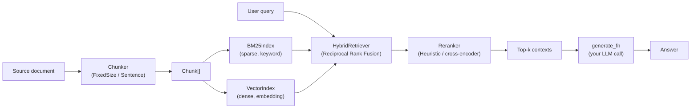
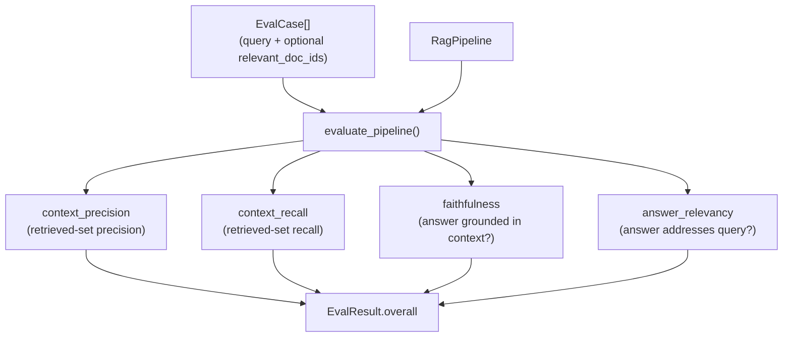

# Architecture

## Pipeline overview

## Evaluation flow (RAGAS-style)

## Design decisions

- **Reciprocal Rank Fusion, not a weighted score blend.** BM25 scores and
  cosine similarities live on different, incomparable scales. RRF fuses
  on rank position (`1 / (k_rrf + rank)`) instead of raw score, so there's
  no blend ratio to tune and no risk of one signal silently dominating
  because its scores happen to be numerically larger.
- **Reranking is a separate, pluggable stage.** Retrieval optimizes for
  recall over a large corpus cheaply; a reranker spends more compute on
  a small candidate set for a more precise final ordering -- the standard
  two-stage pattern in production search. `HeuristicReranker` (token
  overlap) is a dependency-free stand-in; swapping in a real
  cross-encoder model doesn't change the pipeline's shape.
- **Two chunking strategies, not one default.** `FixedSizeChunker`
  (word-count + overlap) suits homogeneous text where boundaries don't
  carry meaning; `SentenceChunker` (sentence-count + overlap) suits prose
  where cutting mid-sentence loses meaning. Making the choice explicit
  surfaces a real production tradeoff instead of hiding it.
- **Context precision/recall require ground truth and say so.** When a
  test case doesn't specify `relevant_doc_ids`, those two metrics report
  `None` rather than a misleading `0.0` -- silently scoring "no ground
  truth provided" the same as "retrieval failed" would hide real
  regressions.
- **`hashing_embed` is lexical, not semantic, by design.** It's a
  dependency-free default that keeps chunking, hybrid retrieval, and
  evaluation runnable offline in tests and CI. Anything that depends on
  real semantic similarity (paraphrase matching, RAGAS-quality faithfulness
  scoring) should pass a real embedding model as `embed_fn`.
