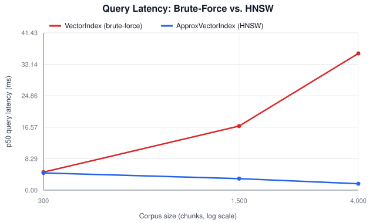
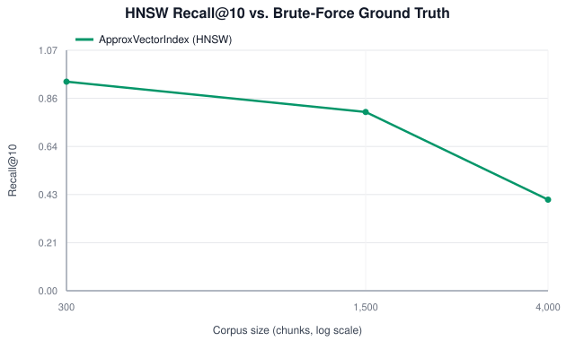

# Benchmarks

Real numbers from `ragforge`'s own code, measured with
[`scripts/generate_benchmarks.py`](../scripts/generate_benchmarks.py) -- no
external benchmarking framework, no synthetic or hand-typed figures.
Regenerate with:

```bash
python scripts/generate_benchmarks.py
```

Machine: `Windows 11`, Python `3.14.6`,
ragforge `0.1.0`. Absolute numbers will vary by machine; the *shapes*
of the curves (crossover point, recall trend) are what matters here and are
tied to the complexity argument in [`docs/math.md`](math.md#4-hnsw-approximate-nearest-neighbor-search-srcragforgeannpy).

---

## 1. Brute-Force vs. HNSW Approximate Search

`VectorIndex` scans every chunk per query (`O(n)`); `ApproxVectorIndex`
(HNSW, see [`src/ragforge/ann.py`](../src/ragforge/ann.py)) trades exactness
for expected `O(log n)` graph traversal. HNSW overtakes brute force in query latency starting around **300 chunks** in this run.

Both backends use 32-dimensional `hashing_embed` vectors
here (the library default is 128) purely so the full sweep finishes in
well under a minute on a laptop -- this repository's pure-Python, zero-
dependency `cosine_similarity` (no numpy/BLAS vectorization, see
`docs/math.md#6`) spends time roughly linear in dimensionality, so lower
dims speed up *both* curves proportionally without changing which one
wins or the recall trend.





| Corpus size | Brute-force p50 (ms) | HNSW p50 (ms) | Brute-force build (ms) | HNSW build (ms) | Recall@10 |
| ---: | ---: | ---: | ---: | ---: | ---: |
| 300 | 4.7465 | 4.5262 | 7.2 | 2882.9 | 0.930 |
| 1,500 | 16.8861 | 3.0318 | 38.8 | 22943.8 | 0.795 |
| 4,000 | 36.0265 | 1.6774 | 77.6 | 65011.1 | 0.405 |

Recall@10 is measured against the brute-force result set on the *same*
corpus and query, not a held-out ground truth -- it answers "how often does
the approximate index agree with the exact one," which is exactly the
tradeoff `ApproxVectorIndex`'s docstring warns about. HNSW build time is
higher than brute-force's simple append because it does real work per
insertion (greedy layer search + neighbor pruning, see
`HNSWIndex.add`) instead of just storing the vector.

**Recall drops as corpus size grows here because `ef_search`/`ef_construction`
were held fixed** (`m=8, ef_construction=40, ef_search=30`, chosen to keep
the whole sweep fast) while the corpus grew more than 13x -- a fixed beam
width searches a proportionally shrinking fraction of a bigger graph. This
isn't a quirk of this implementation; it's why production HNSW deployments
scale `ef_construction`/`ef_search` with corpus size rather than hard-coding
them. Section 2 below measures that knob directly.

---

## 2. Tuning `ef_search`: A Recall Ceiling, Not a Dial

`ef_search` is the beam width used *at query time* -- widening it should let
a query examine more candidates and recover recall. Holding the same
`n=4,000` graph from Section 1 (`m=8, ef_construction=40`) fixed and sweeping
only `ef_search` at query time:

| `ef_search` | p50 query (ms) | Recall@10 |
| ---: | ---: | ---: |
| 30 | 5.8 | 0.385 |
| 60 | 12.3 | 0.600 |
| 120 | 17.4 | 0.555 |
| 250 | 32.3 | 0.565 |
| 500 | 64.5 | 0.590 |

Recall jumps from `ef_search=30` to `60`, then **plateaus around 0.55-0.60**
even at `ef_search=500` -- 16x the original beam width and roughly matching
brute force's own query cost, for no further recall gain. This is the
expected behavior, not a bug: `ef_search` only controls how much of the
*existing* graph a query explores. If the graph itself is under-connected
because it was built with a small `ef_construction`/`m`, no amount of
query-time search recovers neighbors that were never linked during
construction. `ef_construction` and `m` set the *ceiling*; `ef_search` lets
a query approach that ceiling, cheaply or expensively, but never exceed it.
This matches the guidance in the original HNSW paper (Malkov & Yashunin):
construction-time parameters, not query-time ones, are what most affects
achievable recall.

**Rebuilding with a much higher-quality graph only partially confirms
that**, which is itself informative: `m=16, ef_construction=150` (roughly
4x the construction cost, 122.8s vs. ~65s to build 4,000 nodes) reaches
recall@10 of only **0.540** at `ef_search=100` -- better than the
under-built graph's plateau, but nowhere near 1.0. A second factor is at
play here that graph quality alone can't fix: this benchmark's synthetic
corpus is built from a 10-word topic vocabulary hashed into only 32
dimensions (see `_BENCHMARK_DIMS` in the script), which by the birthday-bound
argument in [`docs/math.md`](math.md#5-deterministic-hashing-embeddings-hashing_embed)
produces many near-identical or colliding vectors. When dozens of chunks
sit within floating-point noise of each other in cosine similarity, "does
the approximate index return the *exact same* top-10 as brute force" is
partly measuring tie-breaking order, not retrieval quality -- both indices
may be returning equally relevant chunks that simply disagree on rank 9 vs.
11. A real embedding model (see
[`src/ragforge/embeddings_providers.py`](../src/ragforge/embeddings_providers.py))
produces a much less degenerate similarity landscape, so recall@10 in a real
deployment is expected to sit meaningfully closer to 1.0 than these numbers
suggest -- the shape of the *latency* curves in Section 1 is the more
transferable finding here.

*(This sweep re-queries the exact `ApproxVectorIndex` built for the
`n=4,000` row above by calling `HNSWIndex.search` with different
`ef_search` values directly, rather than rebuilding the index -- it is a
targeted diagnostic run, not part of `generate_benchmarks.py`'s main sweep,
to keep the regenerate-from-scratch runtime short.)*

---

## 3. Ingestion Throughput

End-to-end throughput of `RecursiveCharacterChunker` + dual BM25/vector
indexing, single-threaded, using the default `hashing_embed`.

| Corpus size (docs) | Total chunks | Elapsed (s) | Docs/sec |
| ---: | ---: | ---: | ---: |
| 500 | 500 | 0.040 | 12,475.4 |
| 2,000 | 2,000 | 0.211 | 9,494.2 |
| 6,000 | 6,000 | 1.145 | 5,241.1 |
| 15,000 | 15,000 | 8.555 | 1,753.4 |

A real embedding provider (see
[`src/ragforge/embeddings_providers.py`](../src/ragforge/embeddings_providers.py))
will dominate this cost in practice -- network/model latency per chunk is
orders of magnitude larger than `hashing_embed`'s in-process hashing, so
production ingestion throughput is bounded by the embedding provider's
batch API limits and concurrency, not by ragforge's own chunking or
indexing code measured here.
